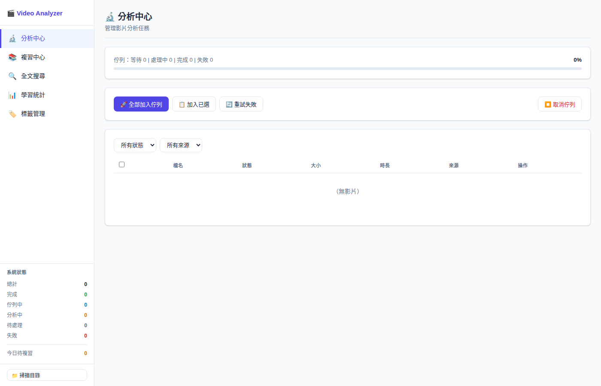
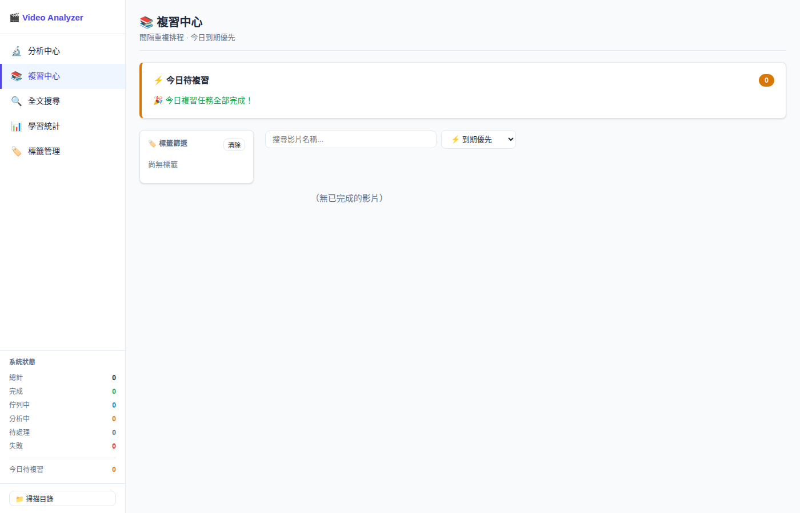
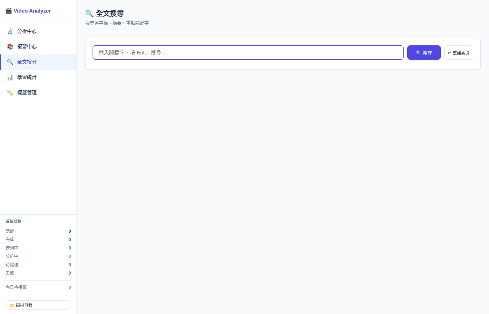
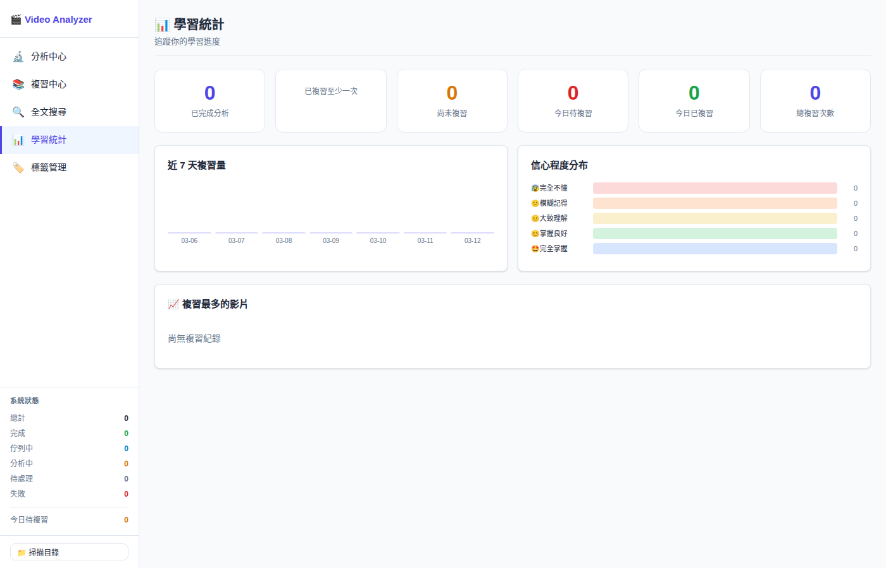
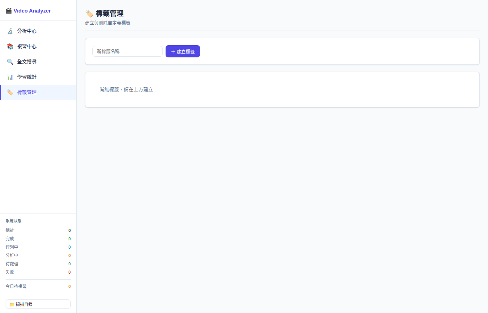
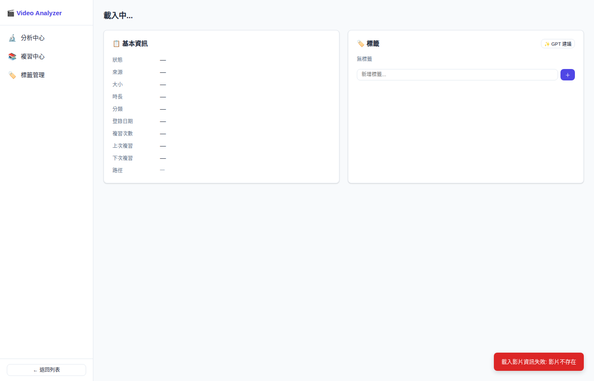

# 🎬 Video Analyzer

本地影片批量分析系統，針對擁有大量影片（數百支）的使用場景設計。整合 OpenAI Whisper 語音轉文字與 Azure OpenAI GPT 進行深度內容分析，並提供完整的複習管理功能。

---

## 🐳 快速啟動（Docker，推薦）

不需安裝 Python、FFmpeg 等任何依賴，所有環境皆封裝在 container 中。

```bash
# 1. Clone 專案
git clone https://github.com/hwchiu/mochia.git
cd mochia

# 2. 填入 API Key
cp .env.example .env
nano .env   # 填入 AZURE_OPENAI_API_KEY、OPENAI_API_KEY

# 3. 設定影片目錄
echo 'VIDEO_DIR=/path/to/your/videos' >> .env

# 4. 啟動
docker compose up -d

# 5. 開啟瀏覽器
open http://localhost:8000

# 6. 掃描影片目錄
docker compose exec web python cli.py scan /videos
```

### 日常操作

```bash
docker compose up -d           # 啟動
docker compose down            # 停止
docker compose logs -f web     # 查看 web 日誌
docker compose logs -f worker  # 查看 worker 日誌
bash update.sh                 # 升級到最新版本
```

### 升級版本

```bash
bash update.sh
# 等同於：docker compose pull && docker compose up -d
# 資料（SQLite、逐字稿）完整保留，不受影響
```

---

## 🔄 跨機器遷移

資料存放在 Docker named volumes，遷移時只需搬移 volumes 與設定檔，**不需複製整個專案資料夾**。

### 舊機器（備份）

```bash
# 備份 SQLite 資料庫
docker run --rm \
  -v mochia_mochia-data:/data \
  -v $(pwd):/backup \
  alpine tar czf /backup/mochia-data-backup.tar.gz -C /data .

# 備份上傳的附件（如有）
docker run --rm \
  -v mochia_mochia-uploads:/data \
  -v $(pwd):/backup \
  alpine tar czf /backup/mochia-uploads-backup.tar.gz -C /data .
```

### 新機器（還原）

```bash
# 1. Clone 專案並設定 .env
git clone https://github.com/hwchiu/mochia.git
cd mochia
cp .env.example .env && nano .env

# 2. 建立 volumes 並還原資料
docker compose up --no-start   # 建立 volumes（不啟動）

docker run --rm \
  -v mochia_mochia-data:/data \
  -v $(pwd):/backup \
  alpine tar xzf /backup/mochia-data-backup.tar.gz -C /data

docker run --rm \
  -v mochia_mochia-uploads:/data \
  -v $(pwd):/backup \
  alpine tar xzf /backup/mochia-uploads-backup.tar.gz -C /data

# 3. 啟動
docker compose up -d
```

> **影片檔案本身不在 volume 內**（系統只存路徑，不複製檔案），需確認新機器上影片路徑相同，或更新 `.env` 的 `VIDEO_DIR`。

---

## 🐍 Python 版本相容性

| Python 版本 | 支援狀態 | 測試方式 | 備註 |
|------------|---------|---------|------|
| 3.10 | ✅ 完整支援 | CI Docker | |
| 3.11 | ✅ 完整支援（推薦）| CI Docker | 主要開發版本 |
| 3.12 | ✅ 完整支援 | CI Docker | |
| 3.13 | ⚠️ 實驗性 | 未測試 | 部分套件尚無 wheel |
| 3.14 | ❌ 不支援 | 未測試 | 套件相容性問題 |
| 3.9 | ⚠️ 部分支援 | 未測試 | 需 `from __future__ import annotations` |
| < 3.9 | ❌ 不支援 | — | — |

> **推薦使用 Python 3.11**。或直接使用 Docker 部署，完全不需要考慮版本問題。

## 🐳 Docker 快速啟動（推薦）

最簡單的跨平台啟動方式，不需安裝 Python、FFmpeg 等依賴：

    # 1. 複製 env 設定
    cp .env.example .env
    # 編輯 .env，填入 Azure OpenAI API Key

    # 2. 設定影片目錄（選填）
    echo 'VIDEO_DIR=/path/to/your/videos' >> .env

    # 3. 啟動
    docker compose up -d

    # 4. 開啟瀏覽器
    open http://localhost:8000

    # 5. 掃描影片（影片掛載到 /videos）
    docker compose exec web python cli.py scan /videos

---

## 📸 截圖

### 分析中心
管理影片分析任務，掌握佇列狀態



### 複習中心
已完成影片的卡片式瀏覽，支援搜尋與標籤篩選



### 全文搜尋
跨影片逐字稿全文搜尋



### 學習統計
追蹤學習進度、複習量與信心分布



### 標籤管理
自訂標籤，12 色調色盤



### 影片詳情
摘要、重點、心智圖、FAQ、對話



---

## 功能特色

### 分析能力
- 🎙️ **自動逐字稿** — Whisper API 語音辨識，支援超長影片自動分段（>25MB）
- 🤖 **GPT 智能分析** — 自動生成摘要、條列式重點整理（依主題分類）、領域自動分類
- 🧠 **心智圖生成** — Markmap 互動式心智圖，支援縮放、拖曳、全螢幕、下載 PNG
- ❓ **FAQ 生成** — 自動產生影片內容問答
- 💬 **影片對話** — 基於逐字稿的 Q&A 對話

### 批量管理
- 📁 **目錄掃描** — macOS 原生資料夾選擇器，遞迴掃描所有支援格式（不複製檔案）
- ⚙️ **背景 Worker** — 獨立進程持續處理佇列，網頁關閉後繼續分析
- 🔄 **斷點續傳** — Worker 重啟自動恢復，重試時若逐字稿已存在可跳過 Whisper
- 📊 **即時進度** — 分步驟進度條（音頻提取 → Whisper → GPT → 生成摘要功能）

### 複習系統
- 🏷️ **自定義標籤** — 自由輸入標籤，GPT 自動建議，12 色調色盤
- 🔍 **標籤篩選** — 複習中心多選 AND 邏輯篩選，卡片式瀏覽
- 🔬 **分析中心** — 管理分析佇列、重試失敗任務
- 📚 **複習中心** — 已完成影片卡片瀏覽，搜尋與標籤篩選

---

## 系統架構

```
├── app/
│   ├── __init__.py          # FastAPI 應用入口
│   ├── config.py            # 環境設定
│   ├── database.py          # SQLAlchemy 模型（含自動 migration）
│   ├── routers/
│   │   ├── videos.py        # 影片 CRUD API
│   │   ├── analysis.py      # 分析 API（佇列、狀態、結果）
│   │   ├── batch.py         # 批量操作、目錄掃描
│   │   └── labels.py        # 標籤管理 API
│   └── services/
│       ├── audio_extractor.py   # FFmpeg 音頻提取
│       ├── transcriber.py       # Whisper 語音轉文字（含分段、心跳進度）
│       └── analyzer.py          # Azure OpenAI GPT 分析
├── static/                  # CSS / JavaScript
├── templates/               # HTML 頁面（index + detail）
├── tests/                   # pytest 測試（112 個）
├── worker.py                # 背景 Worker 進程
├── cli.py                   # CLI 工具
├── main.py                  # 啟動入口
├── setup.sh                 # 首次部署一鍵設定
├── start.sh                 # 啟動服務（app + worker）
└── stop.sh                  # 停止服務
```

---

## 快速開始

> **推薦使用 Docker**，見上方「快速啟動」章節。以下為本地開發（不使用 Docker）的方式。

### 環境需求（本地開發）
- macOS
- Python 3.11+
- FFmpeg（`brew install ffmpeg`）
- Azure OpenAI API Key

### 首次設定

```bash
# 1. Clone 專案
git clone https://github.com/hwchiu/mochia.git
cd mochia

# 2. 一鍵設定（建立 venv、安裝依賴、建立目錄）
bash setup.sh

# 3. 填入 API Key
cp .env.example .env
nano .env

# 4. 啟動服務
bash start.sh
```

訪問：`http://localhost:8000`

### 手動啟動

```bash
source venv/bin/activate

# 啟動 Web App
python main.py

# 另開終端，啟動 Worker
python worker.py
```

---

## 環境變數（.env）

```env
# Azure OpenAI（GPT 摘要分析）
AZURE_OPENAI_API_KEY=your_key
AZURE_OPENAI_ENDPOINT=https://xxx.openai.azure.com/
AZURE_OPENAI_DEPLOYMENT=gpt-4o

# OpenAI Whisper（語音轉文字）
OPENAI_API_KEY=your_key

# 選填
DATA_DIR=./data
UPLOAD_DIR=./uploads
LOG_DIR=./logs
```

---

## API 端點

| 方法 | 路徑 | 說明 |
|------|------|------|
| `GET` | `/api/videos/` | 列出影片（支援狀態、來源、標籤篩選） |
| `POST` | `/api/batch/scan` | 掃描目錄登錄影片 |
| `GET` | `/api/batch/pick-directory` | macOS 原生資料夾選擇器 |
| `POST` | `/api/analysis/{id}/queue` | 加入分析佇列 |
| `GET` | `/api/analysis/{id}/status` | 取得分析進度 |
| `GET` | `/api/analysis/{id}/results` | 取得分析結果 |
| `POST` | `/api/analysis/{id}/reanalyze` | 重新 GPT 分析（保留逐字稿） |
| `POST` | `/api/analysis/{id}/suggest-labels` | GPT 建議標籤 |
| `GET` | `/api/labels/` | 列出所有標籤 |
| `POST` | `/api/labels/videos/{id}` | 為影片新增標籤 |

---

## CLI 工具

```bash
# 查看佇列狀態
python cli.py status

# 掃描目錄並加入佇列
python cli.py scan /path/to/videos --queue

# 重試失敗任務
python cli.py retry

# 查看特定影片詳情
python cli.py show <video_id>
```

---

## 開發

```bash
# 執行測試
venv/bin/python -m pytest tests/ -v
```

---

## 支援的影片格式

`.mp4` `.mkv` `.avi` `.mov` `.wmv` `.flv` `.webm` `.m4v`

---

## 資料庫

SQLite 位於 Docker volume `mochia_mochia-data`，包含：
- `videos`：影片清單（存路徑，不複製影片檔案）
- `transcripts`：逐字稿
- `summaries`：摘要與重點
- `classifications`：分類結果
- `task_queue`：分析任務佇列（Worker 持久化狀態）
